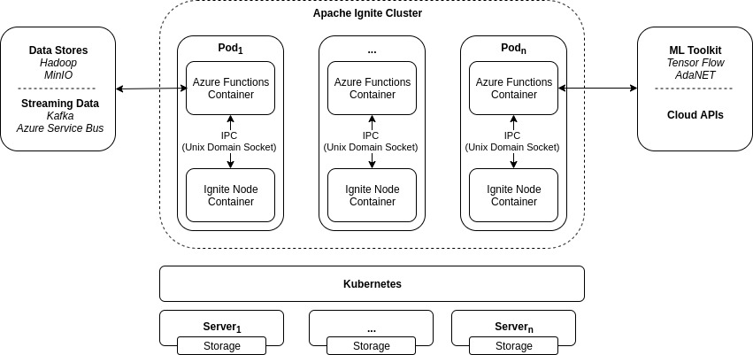

# Perper
*(This project is under active development)*

Stream-based, horizontally scalable framework for asynchronous data 
processing, built on top of [Apache Ignite](https://ignite.apache.org/) 
and [Azure Functions Host](https://github.com/Azure/azure-functions-host).

**Check the [Apocryph](https://github.com/comrade-coop/apocryph) blockchain project as a use case of the Perper framework.**

## Overview

Perper consists of two building blocks: Perper Fabric and Perper Functions. 
Perper Fabric is built on top of Ignite, utilising its data grid, 
compute grid and clustering capabilities to provide orchestration layer 
for Perper Functions. Perper Functions is built on top of Azure Functions 
as Azure Functions Extension and serves as main programming environment 
in Perper.



## Getting started

You can use Perper on all major operating systems: Windows, Linux and macOS.

### Prerequisite

Before running the next steps, you must have the following:

- Install [Azure Functions Core Tools v3](https://docs.microsoft.com/en-us/azure/azure-functions/functions-run-local#v2)
- Install [.NET Core SDK 3.1](https://dotnet.microsoft.com/download/dotnet-core/3.1)
- Install [Docker](https://docs.docker.com/install/)

### Create the local function app project

Run the following command from the command line to create a function app project 
in the PerperFunctionApp folder of the current local directory

```bash
func init PerperFunctionApp
```

When prompted, select a worker runtime - for now only dotnet and python are 
fully supported.

After the project is created, use the following command to navigate to the 
new PerperFunctionApp project folder.

```bash
cd PerperFunctionApp
```

### Enable Perper Functions

In order to use Perper Functions you have to enable Perper Extension for 
Azure Functions. You can do this by cloning Perper GitHub repo and adding a
reference to Perper.WebJobs.Extensions project in the function's project file.

```xml
<Project Sdk="Microsoft.NET.Sdk">
  <PropertyGroup>
    <TargetFramework>netcoreapp3.1</TargetFramework>
    <AzureFunctionsVersion>v3</AzureFunctionsVersion>
  </PropertyGroup>
  <ItemGroup>
    <PackageReference Include="Microsoft.NET.Sdk.Functions" Version="3.0.2" />
  </ItemGroup>
  <ItemGroup>
    <None Update="host.json">
      <CopyToOutputDirectory>PreserveNewest</CopyToOutputDirectory>
    </None>
    <None Update="local.settings.json">
      <CopyToOutputDirectory>PreserveNewest</CopyToOutputDirectory>
      <CopyToPublishDirectory>Never</CopyToPublishDirectory>
    </None>
    </ItemGroup>
    <ItemGroup>
        <ProjectReference Include="../../perper/src/Perper.WebJobs.Extensions/Perper.WebJobs.Extensions.csproj" />
</ItemGroup>
</Project>
```

### Create a function

The way to declare a function and its bindings varies, depending on your 
project language.

#### C#

The first step is to define Launcher function that creates the stream graph
that will be executed: 

*Launcher*
```csharp
using System.Threading;
using System.Threading.Tasks;
using Microsoft.Azure.WebJobs;
using Perper.WebJobs.Extensions.Config;
using Perper.WebJobs.Extensions.Model;

namespace DotNet.FunctionApp
{
    public static class Launcher
    {
        [FunctionName("Launcher")]
        public static async Task RunAsync([PerperStreamTrigger(RunOnStartup = true)]
            PerperStreamContext context,
            CancellationToken cancellationToken)
        {
            await using var generator =
                await context.StreamFunctionAsync(typeof(Generator), new {count = 10 });
            await using var consumer =
                await context.StreamActionAsync(typeof(Consumer), new {generator});

            await context.BindOutput(cancellationToken);
        }
    }
}
```

Then we have to create the corresponding functions for the two streams (Generator and Consumer):

*Generator*
```csharp
using System.Threading;
using System.Threading.Tasks;
using DotNet.FunctionApp.Model;
using Microsoft.Azure.WebJobs;
using Microsoft.Extensions.Logging;
using Perper.WebJobs.Extensions.Config;
using Perper.WebJobs.Extensions.Model;

namespace DotNet.FunctionApp
{
    public static class Generator
    {
        [FunctionName("Generator")]
        public static async Task Run([PerperStreamTrigger] PerperStreamContext context,
            [Perper("count")] int count,
            [PerperStream("output")] IAsyncCollector<Data<int>> output,
            ILogger logger, CancellationToken cancellationToken)
        {
            for (var i = 0; i < count; i++)
            {
                await output.AddAsync(new Data<int> {Value = i}, cancellationToken);
            }
        }
    }
}
```


*Consumer*
```csharp
using System.Collections.Generic;
using System.Threading;
using System.Threading.Tasks;
using DotNet.FunctionApp.Model;
using Microsoft.Azure.WebJobs;
using Microsoft.Extensions.Logging;
using Perper.WebJobs.Extensions.Config;
using Perper.WebJobs.Extensions.Model;

namespace DotNet.FunctionApp
{
    public static class Consumer
    {
        [FunctionName("Consumer")]
        public static async Task RunAsync([PerperStreamTrigger] PerperStreamContext context,
            [PerperStream("generator")] IAsyncEnumerable<Data<int>> generator,
            ILogger logger, CancellationToken cancellationToken)
        {
            await foreach (var data in generator.WithCancellation(cancellationToken))
            {
                logger.LogInformation($"Consumer stream receives: {data.Value}");
            }
        }
    }
}
```

To enable logging edit the *host.json* file as follows:

```json
{
    "version": "2.0",
    "logging": {
        "logLevel": {
            "PerperFunctionApp": "Information",
            "Perper.WebJobs.Extensions.Triggers": "Information"
        }
    }
}
```

#### Python

*(TODO: Add step by step instructions for creating Python worker function)*

### Run the function locally

Before running the function locally you have to start Perper Fabric in local 
development mode:

- Building Perper Fabric Docker
```bash
docker build -t perper/fabric -f docker/Dockerfile .
```
- Create Perper Fabric IPC directory  
```bash
mkdir -p /tmp/perper
```
- Run Perper Fabric Docker 
```bash
docker run -v /tmp/perper:/tmp/perper --network=host --ipc=host -it perper/fabric
```

The following command starts the function app. The start command varies, 
depending on your project language.

#### C#

```bash
func start --build
```

#### Python

```bash
func start
```

## Contributing
Pull requests are welcome. For major changes, please open an issue first 
to discuss what you would like to change.

Please make sure to update tests as appropriate.

### Development environment

Perper Fabric and Perper Functions are built from a common code base 
and therefore use a single common development environment. For now the 
recommended development environment is Ubuntu 18.04 LTS.

### Prerequisite

Before running this sample, you must have the following:

- Install [Azure Functions Core Tools v3](https://docs.microsoft.com/en-us/azure/azure-functions/functions-run-local#v2)
- Install [.NET Core SDK 3.1](https://dotnet.microsoft.com/download/dotnet-core/3.1)
- Install [Apache Ignite .NET](https://apacheignite-net.readme.io/docs/cross-platform-support)

### Build

*(TODO: Add step-by-step instructions on setting up a local development environment.)*

## License
[MIT](https://github.com/obecto/perper/blob/master/LICENSE)
