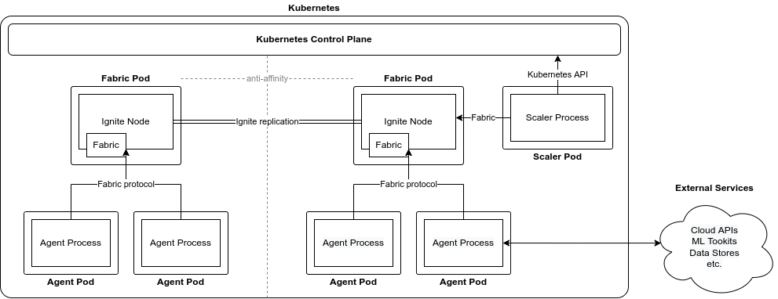

# Architecture

Perper consists of two main building blocks: Perper Fabric and Perper Agents, arranged in a hub-and-spoke architecture. All the agents connect to a Fabric backbone, which serves as an orchestration and storage layer.

## Fabric

Perper Fabric is built on top of Ignite, utilising its data grid, compute grid and clustering capabilities to provide orchestration layer for agents.

Fabric exposes a GRPC interface that complements Ignite's default thin client interface by adding the ability to listen for executions and streams.

Additionally, Fabric keeps track of stream listeners and ephemeral streams

In the future, Fabric would also be responsible for checking and securing capabilities.

## Scaler

The Scaler is a service component that dictates how agents instances are started, run, and stopped. It may allow for different agents' instances to run in seperate processes, to be scaled on demand, or to run local to data, based on scaler-specific configuration.

Under the hood, the scaler uses the same executions interface as agents to expose a special scaler agent, whose every execution represents an agent.

Currently, there are two implementations of the Scaler: one using Kubernetes to scale Pods and one using Docker Compose to scale Docker containers.

## Agent processes

Agent processes are orchestrated by the Scaler and implement the business logic of an application built on top of Perper. Each agent process connects to Perper Fabric and processes the executions it receives. An agent process can handle executions linked to one or multiple instances of an agent, and, in exotic cases, can handle executions related to multiple agents.

Agent processes are typically implemented using one of the available agent libraries.

### .NET agent library architecture

The .NET agent library is split into 3 layers:
* The Protocol layer: Implements the [Fabric Protocol](./protocol.md), as a FabricService singleton which encapsulates the connection to Perper Fabric.
  * The Model layer: contains definitions of standard objects from the protocol, that are not required for using Fabric but are basic to working with libraries in other languages.
* The Extensions layer: Contains extension methods that allow using objects from the Model layer without needing to refer to the Protocol layer directly. (It achieves that by using [`AsyncLocal`](https://docs.microsoft.com/en-us/dotnet/api/system.threading.asynclocal-1)-s to pass the Perper connection and execution metadata through the C# async context.)
* The Application layer: contains classes for starting up a Perper Agent Process and hooking up methods to handle Executions.

### Python agent library architecture

The Python agent library follows the same general architecture as the .NET agent library.
