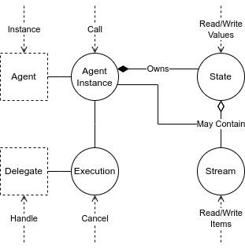

# Concepts

 
 Table of Contents 

* [Perper application](#perper-application)
* [Agent](#agent)
  * [Agent Instance](#agent-instance)
  * [Agent Type](#agent-type)
* [Execution](#execution)
  * [Delegate](#delegate)
* [State](#state)
* [Stream](#stream)
  * [Stream Item](#stream-item)
  * [Packed Stream](#packed-stream)
  * [Ephemeral Stream](#ephemeral-stream)
  * [Indexed Stream](#indexed-stream)
* [Object Capabilities](#object-capabilities)

## Perper application

A Perper application is composed of many [Agents](#agent) -- encapsulated distributed objects that can hold [State](#state), processes [Executions](#execution), and produce or consume [Streams](#stream). All of those are made available through [Object Capabilities](#object-capabilities), meaning that the only way to be able to use an Agent, State, Execution, or Stream is through a reference to it.

## Agent

Agents are similar to classes in conventional OOP programming. They can be instantiated, producing an [Agent Instance](#agent-instance) (confusingly often also called an "Agent"); they can hold State; they can expose [Delegates](#delegate) to be called via [Executions](#execution); and they can interact with [Streams](#stream). As such, agents are the basic unit of encapsulation within a Perper application.

### Agent Instance

An Agent Instance is an individual instance of an [Agent](#agent).

### Agent Type

"Agent Type" is a term used for disambiguation in cases when "[Agent](#agent)" might be misinterpreted to mean "[Agent Instance](#agent-instance)".

## Execution

In Perper, Executions are used to model anything that needs to run, is currently running, or has just finished running. Every Execution is associated with an [Agent Instance](#agent-instance) and may contain arbitrary parameters from the caller, or, once it's finished, a result or error value.

Keeping in our analogy with typical OOP programming, Executions take on roughly the role of stack frames.

### Delegate

The Delegate of an [Executions](#execution) corresponds to the method name that is being called on the [Agent Instance](#agent-instance).

## State

States are a distributed key-value stores that can be accessed by [Executions](#execution) in order to persist data. They ensure that even if a machine or a process dies, execution can continue when the affected processes are restarted elsewhere.

An [Agent Instance](#agent-instance) can own multiple States.

<!--In later versons, there would also be the option for a State to be free-standing and shared between Agent Instances, akin to shared memory.-->

## Stream

Streams are similar to [States](#state) in that they allow for data to be persisted. However, unlike States, they also allow for listeners to wait until there is new data available for reading.

Perper allows for the construction of arbitrary stream graphs between [Executions](#execution) at runtime, including cyclic graphs.

Every Stream can have multiple [Executions](#execution) writing to it and multiple [Executions](#execution) listening for new items. Every listener receives the whole contents of the Stream.

### Stream Item

A Stream Item is a value inside a [Stream](#stream). Every Stream Item needs a monotonically increasing integer key, which allows all listeners to end up with the same order of Items inside the Stream.

### Packed Stream

[Streams](#stream) marked as "packed" allow for items to be written out of order, as long as writers use consecutive keys -- those are, for example, useful for modeling time series data.

### Ephemeral Stream

[Streams](#stream) marked as "ephemeral" delete their [Items](#stream-item) after the all listeners have finished processing them.
In contrast, "persistent" Streams do not delete its items automatically.

### Indexed Stream

A [Stream](#stream) can be indexed, and later queried, allowing for the fast retrieval of items from the Stream without needing to iterate all of it.

## Object Capabilities

Perper makes use of Object Capabilities for security. The only way for user code to access an object (be it an Agent, or a Stream, or something else) in a Perper system is through a reference to it. Such a reference can be obtained only by either directly creating the object or receiving a reference to it.

You can read more about the Object-Capability Model on [Wikipedia](https://en.wikipedia.org/wiki/Object-capability_model).

