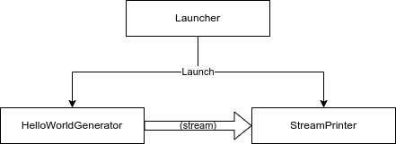

# .NET Usage Tutorial

<details> <summary> Table of Contents </summary>

* [Prerequisites](#prerequisites)
* [Starting Perper Fabric](#starting-perper-fabric)
* [Step by step tutorial](#step-by-step-tutorial)
  * [Creating an agent](#creating-an-agent)
  * [Writing the Launcher](#writing-the-launcher)
  * [Adding and calling another function](#adding-and-calling-another-function)
  * [Adding a stream](#adding-a-stream)
  * [Adding another agent](#adding-another-agent)
* [Usage sample code](#usage-sample-code)
  * [Exploration ideas](#exploration-ideas)
* [Closing note](#closing-note)

</details>

In this usage tutorial, we are going to build a small demo app that streams a "Hello World" message. To this end, we are going to create 3 functions: a `Launcher` that starts a `HelloWorldGenerator` and passes the resulting stream to a `StreamPrinter`.



## Prerequisites

* A cursory understanding of the [Concepts](./concepts.md)
* A [.NET Runtime and SDK](https://dotnet.microsoft.com/en-us/download) (version 6.0)
* Either [Docker](https://docs.docker.com/get-docker/) (/[Podman](https://podman.io/getting-started/installation)) or [Java JDK 11 or higher](https://openjdk.java.net/install/)

## Starting Perper Fabric

Before we begin, start an instance of Perper Fabric; this will allow us to run parts of the sample as we proceed.

```bash
$ docker run --rm -p 10800:10800 -p 40400:40400 obecto/perper-fabric:0.8.0 config/example.xml
```

<details> <summary>(Alternatively, if using a local Perper clone)</summary>

From the root of a clone of the Perper repository, run:

```bash
$ cd path/to/perper/fabric
fabric$ ./gradlew run --args="config/example.xml"
```

</details>

Note that in `0.8.0-beta1` you might want to occasionally restart Fabric by interrupting (Ctrl-C) the process and running it again, since starting our `Launcher` over and over will result in many `HelloWorldGenerator` / `StreamPrinter`-s running.

## Step by step tutorial

Note that if you feel like following the step-by-step tutorial and want to go directly for some off-roads experimentation, you can jump down to the [Exploration ideas](#exploration-ideas) at the end.

### Creating an agent

To create a new agent, create a new Console .NET project and add a reference to the [`Perper`](https://www.nuget.org/packages/Perper) NuGet package:

```bash
$ dotnet new console -o MyFirstAgent
$ cd MyFirstAgent
MyFirstAgent$ dotnet add package Perper
```

<details> <summary>(Alternatively, if using a local Perper clone)</summary>

Change the last command to:

```bash
MyFirstAgent$ dotnet add reference path/to/perper/agent/dotnet/src/Perper
```

</details>

Then, change the default `Program.cs` boilerplate to:

```c#
using Perper.Application;
using Microsoft.Extensions.Hosting;
Host.CreateDefaultBuilder().ConfigurePerper(perper => perper.AddAssemblyHandlers("MyFirstAgent")).Build().Run();
```

Congratulations, you now have a Perper agent! An empty one, but an agent nonetheless.

If you were to run the project right now, it would print something like the following before exiting:

```
info: Perper.Application.PerperBuilder[0]
      APACHE_IGNITE_ENDPOINT: 127.0.0.1:10800
info: Perper.Application.PerperBuilder[0]
      PERPER_FABRIC_ENDPOINT: http://127.0.0.1:40400
info: Microsoft.Hosting.Lifetime[0]
      Application started. Press Ctrl+C to shut down.
```

(Possibly along with a few other stray logs)

#### What just happened?

* The agent process's entrypoint, `Program.cs`, got called.
* In turn, it instanced a `HostBuilder`/`IHost`, a standard C# mechanism for managing application lifecycle.
* Then, it used `ConfigurePerper`, a utility that lets us turn that host into a Perper agent process by providing an `IPerperBuilder` to add handlers for the different delegates (methods) that may be called on the instances of that agent.
* It then called `AddAssemblyHandlers`, which went through the classes in the assembly's root namespace that have a `Run` or `RunAsync` method and added them as handlers for `"MyFirstAgent"` to the `PerperStartup`.
  * `AddAssemblyHandlers` can also use another assembly or look for classes filtered by another namespace. Alternatively, there is `AddClassHandlers` which would add all of a class's methods as handlers. Or, one could also use `AddHandler`/`AddInitHandler` to specify handlers manually. For now, we will stick to `AddAssemblyHandlers`, as it allows us to split our code more easily.
* Finally, `IHost`'s `Run` method got called, and it printed some debug information before connecting to Fabric, and then some more debug information.
* At this point, we still haven't defined any handlers, so our agent process ends up doing nothing apart from connecting... but we are going to fix in a moment.

### Writing the Launcher

Let's start implementing our agent by adding the launcher function, which would then set up the stream graph printing "Hello World". As we don't have anything for that launcher to call yet, it will just directly print "Hello World" for now.

`AddAssemblyHandlers` expects our launcher to be a class named `Deploy` somewhere under the `MyFirstAgent` namespace, so, add a new file called `Deploy.cs` with the following code:

```c#
using System;
using System.Threading.Tasks;
namespace MyFirstAgent // <- AddAssemblyHandlers is going to be looking in this namespace by default.
{
    public static class Deploy // <- The class name is used for the handler's name, "Deploy"
                               // Note that static is not required; non-static handler classes are automatically instanced
    {
        public static async Task RunAsync() // <- All classes with a Run or RunAsync method are turned into handlers
        {
            Console.WriteLine("Hello world from Deploy!");
            await Task.Delay(1); // <- A delay to avoid the warning about async method lacking await.
        }
    }
}
```

Now, if you run the project... you should see something like this:
```
...
Hello world from Deploy!
```

Yay!

#### What just happened?

* `AddAssemblyHandlers` found our `Deploy` class, and used `AddHandler` to register it to `PerperStartup`, automatically wrapping it in a `MethodPerperHandler` and picking a `DeployPerperListener` for it.
  * `MethodPerperHandler` is a low-level utility class that wraps a .NET method, handling things like `Task`/`ValueTask`/`IAsyncEnumerable` return values.
  * `DeployPerperListener` is a service that invokes the handler as soon as it connects to Perper.
* The `DeployPerperListener` called our `RunAsync` function as part of starting the host.
* The process remains there, waiting for us to press Ctrl-C. Let's fix that!

### Adding and calling another function

Next, let's add the `StreamPrinter` function and call it. For the time being, we won't actually pass it a stream, but just showcase calling a function in Perper.

Create a `StreamPrinter.cs` file (similar to the `Deploy.cs` from before):

```c#
using System;
using System.Threading.Tasks;
namespace MyFirstAgent
{
    public static class StreamPrinter // <- Creates a handler for the "StreamPrinter" delegate
    {
        public static async Task RunAsync()
        {
            Console.WriteLine("Hello world from StreamPrinter!");
            await Task.Delay(1);
        }
    }
}
```

Then modify `Deploy.cs` so it would call the `StreamPrinter`:

```c#
using System;
using System.Threading.Tasks;
using Perper.Extensions;
namespace MyFirstAgent
{
    public static class Deploy
    {
        public static async Task RunAsync()
        {
            Console.WriteLine("Hello world from Deploy!");
            await PerperContext.CallAsync("StreamPrinter"); // <- Call the "StreamPrinter" handler on the same agent
        }
    }
}
```

And now, running the project should result in something like this:
```
...
Hello world from Deploy!
Hello world from StreamPrinter!
```

#### What just happened?

* `AddAssemblyHandlers` found our `StreamPrinter` class as well, using `AddHandler` to register it; picking an `ExecutionPerperListener` this time around.
* The `DeployPerperListener` called our `Deploy` handler. In parallel, the `ExecutionPerperListener` started listening for executions for `StreamPrinter`.
* Our `Deploy` handler used `PerperContext.CallAsync` to create a new execution for `StreamPrinter`.
* The `ExecutionPerperListener` picked up the execution for `StreamPrinter` and called our handler.
* Our `StreamPrinter` handler printed a hello world message. Except... it's still not coming from a stream.

### Adding a stream

To meet our initial objective of receiving the hello world message over a stream, let's add the `HelloWorldGenerator` stream. This would be a slightly bigger change, as we are also going to modify `Deploy` and `StreamPrinter` to use the stream.

Create a `HelloWorldGenerator.cs` file, with the following contents:

```c#
using System;
using System.Collections.Generic;
using System.Threading.Tasks;
namespace MyFirstAgent
{
    public static class HelloWorldGenerator // <- Creates a handler for the "HelloWorldGenerator" delegate
    {
        public static async IAsyncEnumerable<char> RunAsync() // The IAsyncEnumerable return value makes this a stream handler
        {
            Console.WriteLine("Hello world from HelloWorldGenerator!");
            foreach (var ch in "Hello world through stream!")
            {
                yield return ch; // (see also https://docs.microsoft.com/en-us/dotnet/csharp/programming-guide/concepts/async/async-return-types#async-streams-with-iasyncenumerablet)
                await Task.Delay(100); // <- By delaying the time between characters, we'd be able to actually see them pop on screen one-by-one
            }
        }
    }
}
```

Then modify `Deploy.cs` to call the new `HelloWorldGenerator` and pass the resulting stream to `StreamPrinter`:

```c#
using System;
using System.Threading.Tasks;
using Perper.Model;
using Perper.Extensions;
namespace MyFirstAgent
{
    public static class Deploy
    {
        public static async Task RunAsync()
        {
            Console.WriteLine("Hello world from Deploy!");
            PerperStream stream = await PerperContext.CallAsync<PerperStream>("HelloWorldGenerator"); // <- Get an object representing our stream
            await PerperContext.CallAsync("StreamPrinter", stream); // <- Pass the PerperStream to StreamPrinter
        }
    }
}
```

And finally, modify `StreamPrinter.cs` to receive and process the stream:

```c#
using System;
using System.Threading.Tasks;
using Perper.Model;
using Perper.Extensions;
namespace MyFirstAgent
{
    public static class StreamPrinter
    {
        public static async Task RunAsync(PerperStream streamToPrint) // <- Receive the passed PerperStream as a parameter
        {
            Console.WriteLine("Hello world from StreamPrinter!");
            await foreach (var ch in streamToPrint.EnumerateAsync<char>())
            {
                Console.Write(ch);
            }
        }
    }
}
```

And now, running the project should finally result in something looking like this:
```
...
Hello world from Deploy
Hello world from StreamPrinter!
Hello world from HelloWorldGenerator!
Hello World through stream!
```

#### What just happened?

* `AddAssemblyHandlers` found our `HelloWorldGenerator` class, and register it as a picking an `StreamPerperListener`. The `StreamPerperListener` started listening for executions related to the `HelloWorldGenerator`.
* Our `Deploy` handler got called.
* Our `Deploy` handler used `PerperContext.CallAsync<>` to call `"HelloWorldGenerator"` and get a `PerperStream` representing the resulting stream.
  * The `PerperStream` is automatically returned by the `StreamPerperListener`, as it starts a long-running execution for the stream in the background.
* The `StreamPerperListener` called our `HelloWorldGenerator` handler, only for `MethodPerperHandler` to notice it returns an `IAsyncEnumerable`. The latter then started waiting for a listener for that stream.
  * It is possible to make the stream start without waiting for a listener by using `[Perper.Application.PerperStreamOptions(Action=true)]` on the stream class.
* Our `Deploy` handler used `PerperContext.CallAsync` to create a new execution for `StreamPrinter`, and passed it the `PerperStream` object.
* Our `StreamPrinter` handler used `PerperStreamExtensions.EnumerateAsync` to start listening for items added to the stream.
* `MethodPerperHandler` noticed that there is a listener and started our `HelloWorldGenerator` handler, that wrote the hello world text to the stream one character at a time.
* Our `StreamPrinter` handler started receiving and printing the hello world message. Success!

Note: This is the first time you might need to restart Fabric between runs. Since stream completion is [not yet implemented](https://github.com/obecto/perper/issues/68), `StreamPrinter` never completes, and restarting the agent process would slowly result in many leftover `StreamPrinter`-s accumulating. Also, note that stopping the process might take a while, as IHost gives a generous timeout to the `StreamPrinter`.

### Adding another agent

Our code so far achieves the stated goal of streaming a hello world text through Perper. However, to demonstrate more of Perper's functionality and to, uh, promote code reusability, we can move `StreamPrinter` to its own separate agent.

To this end, make another agent project called `StreamPrinterAgent`, adding a reference to Perper like [before](#creating-an-agent).

Then, again as before, change its `Program.cs` to:

```c#
using Perper.Application;
using Microsoft.Extensions.Hosting;
Host.CreateDefaultBuilder().ConfigurePerper(perper => perper.AddAssemblyHandlers("StreamPrinterAgent")).Build().Run();
```

Then, move `StreamPrinter.cs` to the new project, changing it's namespace:

```c#
using System;
using System.Threading.Tasks;
using Perper.Model;
using Perper.Extensions;
namespace StreamPrinterAgent // <- AddAssemblyHandlers wants to have namespaces named just like the assembly/project
{
    public static class StreamPrinter
    {
        public static async Task RunAsync(PerperStream streamToPrint)
        {
            Console.WriteLine("Hello world from StreamPrinterAgent's StreamPrinter!");
            await foreach (var ch in streamToPrint.EnumerateAsync<char>())
            {
                Console.Write(ch);
            }
        }
    }
}
```

And finally, modify the `Deploy.cs` in the original project.

```c#
using System;
using System.Threading.Tasks;
using Perper.Model;
using Perper.Extensions;
namespace MyFirstAgent
{
    public static class Deploy
    {
        public static async Task RunAsync()
        {
            Console.WriteLine("Hello world from Deploy!");
            PerperStream stream = await PerperContext.CallAsync<PerperStream>("HelloWorldGenerator");
            PerperAgent agent = await PerperContext.StartAgentAsync("StreamPrinterAgent"); // <- Create an object representing our agent
            await agent.CallAsync("StreamPrinter", stream); // <- Call the agent's StreamPrinter
        }
    }
}
```

Now, if you run both projects, in separate terminals, you should see that `Deploy` and `HelloWorldGenerator` run in the first agent process / terminal, while `StreamPrinter` runs in the other agent process / terminal.

```
... (first terminal)
Hello world from Deploy
Hello world from HelloWorldGenerator!
... (second terminal)
Hello world from StreamPrinterAgent's StreamPrinter!
Hello World through stream!
```

#### What just happened?

* The first process's `Host.Run` called our `Deploy` handler.
* As before, our `Deploy` handler used `PerperContext.CallAsync<>` to get a `PerperStream` representing a `HelloWorldGenerator` stream.
* Our `Deploy` handler used `PerperContext.StartAgent` to create a new instance of the `StreamPrinterAgent` agent, and get a `PerperAgent` representing it.
    * The stream printer's `Host.Run` then would have called the `Start` handler, had we provided one.
* Our `Deploy` handler then used `PerperContext.CallAsync` to create a new execution for `StreamPrinter`, and passed it the `PerperStream` object.
* The stream printer's `PerperStartup` picked the execution up, and started the `StreamPrinter` handler.
* As before, `StreamPrinter` subscribed to `HelloWorldGenerator`, and the hello world text started flowing across, one character at a time. Woohooo!

And, that's it! You have successfully created two Perper agents; one of which starts the other and streams it a hello world message. Who said hello world had to be [complicated](https://github.com/EnterpriseQualityCoding/FizzBuzzEnterpriseEdition)? <!--Okayyy, fine, the link is to FizzBizz... blame my memory recalling the meme only after writing the whole tutorial about Hello World... ..If you are so keen as to be reading this comment, why don't *you* rewrite it to be about FizzBizz instead? -->

## Usage sample code

You can find the whole code of the usage sample created as part of this tutorial in [`samples/dotnet/MyFirstAgent`](../samples/dotnet/MyFirstAgent) and [`samples/dotnet/StreamPrinterAgent`](../samples/dotnet/StreamPrinterAgent).

### Exploration ideas

If you feel like playing around with the sample further, here is a list of things you could try. Do note that restarting Fabric might be needed to clear out stale executions.

* Try running the agents without Fabric / starting Fabric after the agents. Or try running just one of the agents / running them in different order.
* Try changing the `"StreamPrinterAgent"` string in both `StreamPrinterAgent/Program.cs` and `MyFirstAgent/Deploy.cs`. What happens on mismatch?
* Try changing `HelloWorldGenerator`'s return type. `PerperStream` objects are untyped, so it is possible to enumerate them as the wrong type -- what happens then?
* Try calling `StreamPrinter` multiple times in parallel with the same stream. (Hint: you might need to use `Task.WhenAll`)
* Make `HelloWorldGenerator` accept the string to print as a parameter. Also, give it a default value.
* Make a `GetHello` function which returns a `string` (or `Task<string>`) with the hello world text to print, then call that instead of hardcoding the string.
* Refactor `HelloWorldGenerator` into its own agent.
* Store the `PerperStream` object for `HelloWorldGenerator` inside of `PerperState` instead of a variable.
* Make one of the `Program.cs`-s use `AddInitHandler<T>`/`AddHandler<T>` instead of `AddAssemblyHandlers`.
* Make one of the `Program.cs`-s use `AddClassHandlers<T>` instead of `AddAssemblyHandlers`. (Hint: move all of the functions in that project to one class, and rename the methods to `{Delegate}Async` instead of `RunAsync`)
* Make a new Perper project which includes the other projects, and use multiple invocations of `AddAssemblyHandlers`/`AddClassHandlers` to host all the agents in that one process.

## Closing note

Thank you for following this tutorial; I hope it was useful in figuring out the basics of using Perper through C#! If you want to read more in-depth documentation, feel free to check out the [Architecture](./arciitecture.md) page. Or, if you just want to dive into using the framework, feel free to check out the Reference (currently nonexistent, but the classes in the [`Perper.Extensions`](../agent/dotnet/src/Perper/Extensions/) namespace should be a good place to start)!
