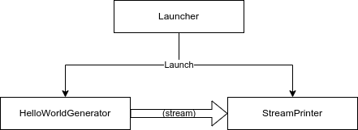

# .NET Usage

In this usage sample, we are going to build a small hello world app, that stream a "Hello World" message.



## Starting Perper Fabric

```bash
$ docker run --rm -p 10800:10800 -p 40400:40400 obecto/perper-fabric:0.8.0 config/example.xml
```

<details> <summary>Alternatively, to use a local Perper clone</summary>

From the root of a clone of the Perper repository, run:

```bash
$ cd path/to/perper/fabric
fabric$ ./gradlew run --args="config/example.xml"
```

</details>

## Creating our first agent

Our first agent would

Create a new .NET project and add a reference to the [`Perper`](https://www.nuget.org/packages/Perper) NuGet package

```bash
$ dotnet new console -o MyFirstAgent
$ cd MyFirstAgent
MyFirstAgent$ dotnet add package Perper
```

<details> <summary>Alternatively, to use a local Perper clone</summary>

Just change the last command to:

```bash
MyFirstAgent$ dotnet add reference path/to/perper/agent/dotnet/src/Perper .
```

</details>


Afterwards, change all of `Program.cs` to:

```c#
using Perper.Application;
await new PerperStartup().AddAssemblyHandlers("MyFirstAgent").RunAsync(default).ConfigureAwait(false);
```

## Writing our first agent

<!--TODO-->

## Running our first agent

<!--TODO-->
